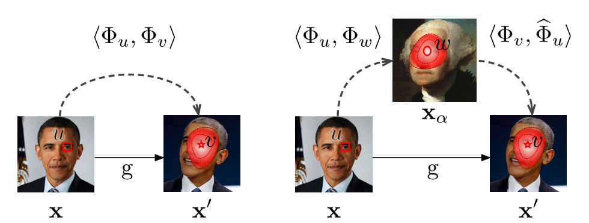

# Descriptor Vector Exchange


This repo provides code for learning dense landmarks without supervision.  Our approach is described in the ICCV 2019 paper "Unsupervised learning of landmarks by exchanging descriptor vectors" ([link]()).




**High level Overview:** The goal of this work is to learn a dense embedding Φ<sub>u</sub>(x) ∈ R<sup>d</sup> of image pixels without annotation. Our starting point was the *Dense Equivariant Labelling* approach of [3] (references follow at the end of the README), which similarly tackles the same problem, but is restricted to learning low-dimensional embeddings to achieve inter-instance generalisation.  The key focus of *Descriptor Vector Exchange (DVE)* is to address this dimensionality issue to enable the learning of more powerful, higher dimensional embeddings while still preserving generalisation. To do so, we take inspiration from methods which enforce transitive/cyclic consistency constraints [4, 5, 6].

The embedding is learned from pairs of images (x,x′) related by a known warp v = g(u). In the image above, on the left we show the approach used by [3], which directly matches embedding Φ<sub>u</sub>(x) from the left image to embeddings Φ<sub>v</sub>(x′) in the right image. On the right, *DVE* replaces Φ<sub>u</sub>(x) with its reconstruction Φˆ<sub>u</sub>(x|xα) obtained from the embeddings in a third auxiliary image xα. Crucially, the correspondence with xα does not need to be known, but the process of learning in this manner encourages the embeddings to act consistently across different instances, even when the dimensionality is increased (see the paper for more details).


**Requirements:** The code assumes PyTorch 1.1 and Python 3.7 (other versions may work, but have not been tested).  See the section on dependencies towards the end of this file for specific package requirements.

### Datasets

In this work we use the following datasets:

**CelebA** is a dataset of over 200k faces of celebrities.  We use this dataset to train our embedding function without annotations. The dataset can be obtained [here](http://mmlab.ie.cuhk.edu.hk/projects/CelebA.html) and was originally described in [this paper](http://openaccess.thecvf.com/content_iccv_2015/papers/Liu_Deep_Learning_Face_ICCV_2015_paper.pdf). This dataset is implemented in the `CelebABase` class in [data_loaders.py](data_loader/data_loaders.py).

**MAFL** is a dataset of over 20k faces which includes landmark annotations.  The dataset is partitioned into 19k training images and 1k testing images.  We follow the protocol used in previous work [2], [3] (and described in more detail below) to evaluate the quality of the embeddings learned on CelebA.

**AFLW** is a dataset of faces which also includes landmark annotations. We use the P = 5 landmark test split (10,122 training images and 2,991 test images). The dataset can be obtained [here](https://www.tugraz.at/institute/icg/research/team-bischof/lrs/downloads/aflw/) and is described in this [2011 ICCV workshop paper](http://citeseerx.ist.psu.edu/viewdoc/download?doi=10.1.1.384.2988&rep=rep1&type=pdf). This dataset is implemented in the `AFLW` class in [data_loaders.py](data_loader/data_loaders.py).


**300-W** This dataset contains 3,158 training images and 689 testing images with 68 facial landmark annotations for each face.  The dataset can be obtained [here](https://ibug.doc.ic.ac.uk/resources/300-W/) and is described in this [2013 ICCV workshop paper](https://www.cv-foundation.org/openaccess/content_iccv_workshops_2013/W11/papers/Sagonas_300_Faces_in-the-Wild_2013_ICCV_paper.pdf). 


### Learned Embeddings

We provide pretrained models for each dataset to reproduce the results reported in the paper [1]. Each model is accompanied by training and evaluation logs and its mean pixel error performance on the task of matching annotated landmarks across the MAFL test set.  The goal of these experiments is to demonstrate that DVE allows models to generalise across identities even when using higher dimensional embeddings (e.g. 64d rather than 3d).  Most of the embeddings are learned with the architecture described by [3].  We also learn one larger model using the hourglass architecture described in [7] (their code is available [here](https://github.com/YutingZhang/lmdis-rep)).

| Embedding Dim | Model | DVE | Same Identity | Different Identity | Links | 
| ------------- | :--:  | :-: | :----: | :----: | :----: |
|  3 | smallnet | :heavy_multiplication_x: | 1.33 | 2.89 | [config](http:/www.robots.ox.ac.uk/~vgg/research/DVE/data/models/celeba-smallnet-3d/2019-08-04_17-55-48/config.json), [model](http:/www.robots.ox.ac.uk/~vgg/research/DVE/data/models/celeba-smallnet-3d/2019-08-04_17-55-48/model_best.pth), [log](http:/www.robots.ox.ac.uk/~vgg/research/DVE/data/log/celeba-smallnet-3d/2019-08-04_17-55-48/info.log) |
|  16 | smallnet | :heavy_multiplication_x: | 1.25 | 5.65 | [config](http:/www.robots.ox.ac.uk/~vgg/research/DVE/data/models/celeba-smallnet-16d/2019-08-04_17-55-52/config.json), [model](http:/www.robots.ox.ac.uk/~vgg/research/DVE/data/models/celeba-smallnet-16d/2019-08-04_17-55-52/model_best.pth), [log](http:/www.robots.ox.ac.uk/~vgg/research/DVE/data/log/celeba-smallnet-16d/2019-08-04_17-55-52/info.log) |
|  32 | smallnet | :heavy_multiplication_x: | 1.26 | 5.81 | [config](http:/www.robots.ox.ac.uk/~vgg/research/DVE/data/models/celeba-smallnet-32d/2019-08-04_17-55-57/config.json), [model](http:/www.robots.ox.ac.uk/~vgg/research/DVE/data/models/celeba-smallnet-32d/2019-08-04_17-55-57/model_best.pth), [log](http:/www.robots.ox.ac.uk/~vgg/research/DVE/data/log/celeba-smallnet-32d/2019-08-04_17-55-57/info.log) |
|  64 | smallnet | :heavy_multiplication_x: | 1.25 | 5.68 | [config](http:/www.robots.ox.ac.uk/~vgg/research/DVE/data/models/celeba-smallnet-64d/2019-08-04_17-56-04/config.json), [model](http:/www.robots.ox.ac.uk/~vgg/research/DVE/data/models/celeba-smallnet-64d/2019-08-04_17-56-04/model_best.pth), [log](http:/www.robots.ox.ac.uk/~vgg/research/DVE/data/log/celeba-smallnet-64d/2019-08-04_17-56-04/info.log) |
|  3 | smallnet | :heavy_check_mark: | TODO | TODO | [config](TODO), [model](TODO), [log](TODO) |
|  16 | smallnet | :heavy_check_mark: | 1.28 | 2.79 | [config](http:/www.robots.ox.ac.uk/~vgg/research/DVE/data/models/celeba-smallnet-16d-dve/2019-08-02_06-20-13/config.json), [model](http:/www.robots.ox.ac.uk/~vgg/research/DVE/data/models/celeba-smallnet-16d-dve/2019-08-02_06-20-13/model_best.pth), [log](http:/www.robots.ox.ac.uk/~vgg/research/DVE/data/log/celeba-smallnet-16d-dve/2019-08-02_06-20-13/info.log) |
|  32 | smallnet | :heavy_check_mark: | 1.29 | 2.79 | [config](http:/www.robots.ox.ac.uk/~vgg/research/DVE/data/models/celeba-smallnet-32d-dve/2019-08-02_06-19-59/config.json), [model](http:/www.robots.ox.ac.uk/~vgg/research/DVE/data/models/celeba-smallnet-32d-dve/2019-08-02_06-19-59/model_best.pth), [log](http:/www.robots.ox.ac.uk/~vgg/research/DVE/data/log/celeba-smallnet-32d-dve/2019-08-02_06-19-59/info.log) |
|  64 | smallnet | :heavy_check_mark: | 1.28 | 2.77 | [config](http:/www.robots.ox.ac.uk/~vgg/research/DVE/data/models/celeba-smallnet-64d-dve/2019-08-02_06-20-28/config.json), [model](http:/www.robots.ox.ac.uk/~vgg/research/DVE/data/models/celeba-smallnet-64d-dve/2019-08-02_06-20-28/model_best.pth), [log](http:/www.robots.ox.ac.uk/~vgg/research/DVE/data/log/celeba-smallnet-64d-dve/2019-08-02_06-20-28/info.log) |
|  64 | hourglass | :heavy_check_mark: | 0.93 | 2.37 | [config](http:/www.robots.ox.ac.uk/~vgg/research/DVE/data/models/celeba-hourglass-64d-dve/0618_103501/config.json), [model](http:/www.robots.ox.ac.uk/~vgg/research/DVE/data/models/celeba-hourglass-64d-dve/0618_103501/model_best.pth), [log](http:/www.robots.ox.ac.uk/~vgg/research/DVE/data/log/celeba-hourglass-64d-dve/0618_103501/info.log) |


**Notes**: The error metrics for the `hourglass` model are included for completeness, but are not exactly comparable to the performance of the smallnet due to slight differences in the cropping ratios used by the two architectures (0.3 for smallnet, 0.294 for Hourglass).  The numbers are normalised to account for the difference in input size, so they are approximately comparable.  Some of the logs are generated from existing logfiles that were created with a slightly older version of the codebase (these differences only affect the log format, rather than the training code itself - the log generator can be found [here](misc/update_deprecated_exps.py).)


### Landmark Regression

**Protocol Description**: To transform the learned dense embeddings into landmark predictions, we use the same approach as [3], which learns a set of 50 "virtual" keypoints (via a spatial softmax).

| Embedding Dim | Model | DVE | Inter-ocular distance | Links | 
| ------------- | :--:  | :-: | :----: | :----: |
|  3 | smallnet | :heavy_multiplication_x: | 4.03 | [config](http:/www.robots.ox.ac.uk/~vgg/research/DVE/data/models/mafl-keypoints-celeba-smallnet-3d/2019-08-08_17-49-48/config.json), [model](http:/www.robots.ox.ac.uk/~vgg/research/DVE/data/models/mafl-keypoints-celeba-smallnet-3d/2019-08-08_17-49-48/model_best.pth), [log](http:/www.robots.ox.ac.uk/~vgg/research/DVE/data/log/mafl-keypoints-celeba-smallnet-3d/2019-08-08_17-49-48/info.log) |
|  16 | smallnet | :heavy_multiplication_x: | 5.38  | [config](http:/www.robots.ox.ac.uk/~vgg/research/DVE/data/models/mafl-keypoints-celeba-smallnet-16d/2019-08-08_17-55-03/config.json), [model](http:/www.robots.ox.ac.uk/~vgg/research/DVE/data/models/mafl-keypoints-celeba-smallnet-16d/2019-08-08_17-55-03/model_best.pth), [log](http:/www.robots.ox.ac.uk/~vgg/research/DVE/data/log/mafl-keypoints-celeba-smallnet-16d/2019-08-08_17-55-03/info.log) |
|  32 | smallnet | :heavy_multiplication_x: | 5.42  | [config](http:/www.robots.ox.ac.uk/~vgg/research/DVE/data/models/mafl-keypoints-celeba-smallnet-32d/2019-08-08_17-56-06/config.json), [model](http:/www.robots.ox.ac.uk/~vgg/research/DVE/data/models/mafl-keypoints-celeba-smallnet-32d/2019-08-08_17-56-06/model_best.pth), [log](http:/www.robots.ox.ac.uk/~vgg/research/DVE/data/log/mafl-keypoints-celeba-smallnet-32d/2019-08-08_17-56-06/info.log) |
|  64 | smallnet | :heavy_multiplication_x: | 4.99 | [config](http:/www.robots.ox.ac.uk/~vgg/research/DVE/data/models/mafl-keypoints-celeba-smallnet-64d/2019-08-08_17-56-47/config.json), [model](http:/www.robots.ox.ac.uk/~vgg/research/DVE/data/models/mafl-keypoints-celeba-smallnet-64d/2019-08-08_17-56-47/model_best.pth), [log](http:/www.robots.ox.ac.uk/~vgg/research/DVE/data/log/mafl-keypoints-celeba-smallnet-64d/2019-08-08_17-56-47/info.log) |
|  3 | smallnet | :heavy_check_mark: | TODO | [config](TODO), [model](TODO), [log](TODO) |
|  16 | smallnet | :heavy_check_mark: | 3.96 | [config](http:/www.robots.ox.ac.uk/~vgg/research/DVE/data/models/mafl-keypoints-celeba-smallnet-16d-dve/2019-08-08_17-55-34/config.json), [model](http:/www.robots.ox.ac.uk/~vgg/research/DVE/data/models/mafl-keypoints-celeba-smallnet-16d-dve/2019-08-08_17-55-34/model_best.pth), [log](http:/www.robots.ox.ac.uk/~vgg/research/DVE/data/log/mafl-keypoints-celeba-smallnet-16d-dve/2019-08-08_17-55-34/info.log) |
|  32 | smallnet | :heavy_check_mark: | 3.86 | [config](http:/www.robots.ox.ac.uk/~vgg/research/DVE/data/models/mafl-keypoints-celeba-smallnet-32d-dve/2019-08-08_17-56-24/config.json), [model](http:/www.robots.ox.ac.uk/~vgg/research/DVE/data/models/mafl-keypoints-celeba-smallnet-32d-dve/2019-08-08_17-56-24/model_best.pth), [log](http:/www.robots.ox.ac.uk/~vgg/research/DVE/data/log/mafl-keypoints-celeba-smallnet-32d-dve/2019-08-08_17-56-24/info.log) |
|  64 | smallnet | :heavy_check_mark: | TODO | [config](TODO), [model](TODO), [log](TODO) |
|  64 | hourglass | :heavy_check_mark: | TODO | [config](TODO), [model](TODO), [log](TODO) |


### Evaluating a pretrained embedding

Evaluting a pretrained model for a given dataset requires:
1. The target dataset, which should be located in `<root>/data/<dataset-name>` (this will be done automatically by the [data fetching script](misc/fetch_datasets.py), or can be done manually).
2. A `config.json` file.
3. A `checkpoint.pth` file.

Evaluation is then performed with the following command:
```
python3 test_matching.py --config <path-to-config.json> --resume <path-to-trained_model.pth> --device <gpu-id>
```
where `<gpu-id>` is the index of the GPU to evaluate on.  This option can be ommitted to run the evaluation on the CPU.

For example, to reproduce the `smallnet-32d-dve` results described above, run the following sequence of commands:

```
# fetch the mafl dataset (contained with celeba) 
python misc/fetch_datasets.py --dataset celeba

# find the name of a pretrained model using the links in the tables above 
export MODEL=data/models/celeba-smallnet-32d-dve/2019-08-08_17-56-24/checkpoint-epoch100.pth

# create a local directory and download the model into it 
mkdir -p $(dirname "${MODEL}")
wget --output-document="${MODEL}" "http://www.robots.ox.ac.uk/~vgg/research/DVE/${MODEL}"

# Evaluate the model
python3 test.py --config configs/celeba/smallnet-32d-dve.json --resume ${MODEL} --device 0
```

### Regressing landmarks

Learning a landmark regressor for a given pretrained embedding requires:
1. The target dataset, which should be located in `<root>/data/<dataset-name>` (this will be done automatically by the [data fetching script](misc/fetch_datasets.py), or can be done manually).
2. A `config.json` file.
3. A `checkpoint.pth` file.

Landmark learning is then performed with the following command:
```
python3 train.py --config <path-to-config.json> --resume <path-to-trained_model.pth> --device <gpu-id>
```
where `<gpu-id>` is the index of the GPU to evaluate on.  This option can be ommitted to run the evaluation on the CPU.

For example, to reproduce the `smallnet-32d-dve` landmark regression results described above, run the following sequence of commands:

```
# fetch the mafl dataset (contained with celeba) 
python misc/fetch_datasets.py --dataset celeba

# find the name of a pretrained model using the links in the tables above 
export MODEL=data/models/celeba-smallnet-32d-dve/2019-08-08_17-56-24/checkpoint-epoch100.pth

# create a local directory and download the model into it 
mkdir -p $(dirname "${MODEL}")
wget --output-document="${MODEL}" "http://www.robots.ox.ac.uk/~vgg/research/DVE/${MODEL}"

# Evaluate the model
python3 test.py --config configs/celeba/smallnet-32d-dve.json --resume ${MODEL} --device 0
```

### Learning new embeddings

Learning a new embedding requires:
1. The dataset used for training, which should be located in `<root>/data/<dataset-name>` (this will be done automatically by the [data fetching script](misc/fetch_datasets.py), or can be done manually).
2. A `config.json` file.  You can define your own, or use one of the provided configs in the [configs](configs) directory.

Training is then performed with the following command:
```
python3 train.py --config <path-to-config.json> --device <gpu-id>
```
where `<gpu-id>` is the index of the GPU to train on.  This option can be ommitted to run the training on the CPU.

For example, to train a `16d-dve` embedding on `celeba`, run the following sequence of commands:

```
# fetch the celeba dataset 
python misc/fetch_datasets.py --dataset celeba

# Train the model
python3 train.py --config configs/celeba/smallnet-16d-dve.json --device 0
```


### Dependencies

If you have enough disk space, the recommended approach to installing the dependencies for this project is to create a conda enviroment via the `requirements/conda-requirements.txt`:

TODO(Samuel)

```
conda env create -f requirements/conda-freeze.yml
```

Otherwise, if you'd prefer to take a leaner approach, you can either:
1. `pip/conda install` each missing package each time you hit an `ImportError`
2. manually inspect the slightly more readable `requirements/pip-requirements.txt`


### Citation

If you find this code useful, please consider citing:

```
@inproceedings{Thewlis2019a,
  author    = {Thewlis, J. and Albanie, S. and Bilen, H. and Vedaldi, A.},
  booktitle = {International Conference on Computer Vision},
  title     = {Unsupervised learning of landmarks by exchanging descriptor vectors},
  date      = {2019},
}
```

### References

[1] James Thewlis, Samuel Albanie, Hakan Bilen, and Andrea Vedaldi. "Unsupervised learning of landmarks by exchanging descriptor vectors" ICCV 2019.

[2] James Thewlis, Hakan Bilen and Andrea Vedaldi, "Unsupervised learning of object landmarks by factorized spatial embeddings." ICCV 2017.

[3] James Thewlis, Hakan Bilen and Andrea Vedaldi, "Unsupervised learning of object frames by dense equivariant image labelling." NeurIPS 2017

[4] Sundaram, N., Brox, T., & Keutzer, K. "Dense point trajectories by GPU-accelerated large displacement optical flow", ECCV 2010

[5] C. Zach, M. Klopschitz, and M. Pollefeys. "Disambiguating visual relations using loop constraints", CVPR, 2010

[6] Zhou, T., Jae Lee, Y., Yu, S. X., & Efros, A. A. "Flowweb: Joint image set alignment by weaving consistent, pixel-wise correspondences". CVPR 2015.

[7] Zhang, Yuting, Yijie Guo, Yixin Jin, Yijun Luo, Zhiyuan He, and Honglak Lee. "Unsupervised discovery of object landmarks as structural representations.", CVPR 2018

### Acknowledgements


We would like to thank [Tom Jakab](http://www.robots.ox.ac.uk/~tomj/) for sharing code.  The project structure uses the [pytorch-template](https://github.com/victoresque/pytorch-template) by @victoresque.